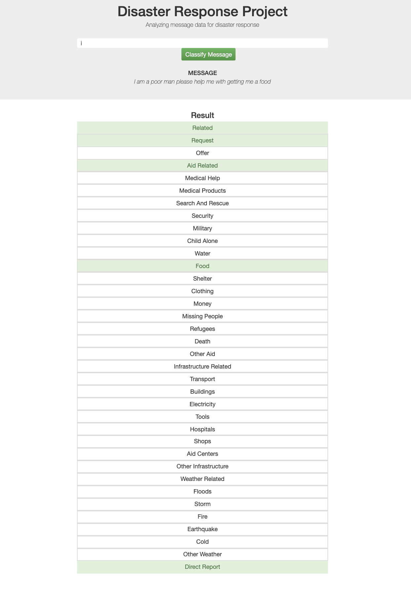

# Disaster Response Pipeline Project

## 1. Installation
I use python 3.6 to create this project and the main libraries I used are:

scikit-learn==0.19.1
SQLAlchemy==1.2.12
nltk==3.2.5
.
.
i've added them in requirements.txt

## 2. Project Motivation

in this project i'm creating a wep app that analyse the input from the end user and process the key words shuch as help , food ..etc that can help in the disaster events and send it to the right agency  by categorising the key words. this project is done as a project to Udacity nano degree program 

this is a sample of the results.

and this is the real application :

## 3. File Descriptions
- \
	- README.md
	- ETL Pipeline Preparation.ipynb
	- ML Pipeline Preparation.ipynb
- \app
	- run.py
	- \templates
	   - go.html
	   - master.html
- \data
	- DisasterResponse.db
	- disaster_categories.csv
	- disaster_messages.csv
	- process_data.py
- \models
	- classifier.pkl : It is too big(about 2GB size)  to be included in the github.  To run ML pipeline that trains classifier and saves the trained model to classifier.pkl
	- train_classifier.py

## 4.Instructions:

     1. Run the following commands in the project's root directory to set up your database and model.

         - To run ETL pipeline that cleans data and stores in database
             `python data/process_data.py data/disaster_messages.csv data/disaster_categories.csv data/DisasterResponse.db`
         - To run ML pipeline that trains classifier and saves
             `python models/train_classifier.py data/DisasterResponse.db models/classifier.pkl`

     2. Run the following command in the app's directory to run your web app.
         `python run.py`

     3. Go to http://0.0.0.0:3001/

## 5. Licensing, Author, Acknowledgements
[Udacity Terms of Service](https://www.udacity.com/legal) for further information.
